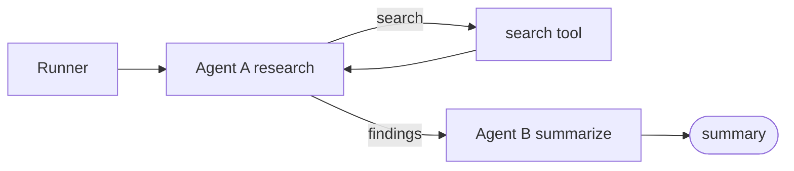

# Agent Spec

Two agents run one task. Agent A researches with a `search` tool on OpenAI, then Agent B
summarizes the findings on Anthropic. There are two builds, ungoverned and governed. They share
the same agents. The only difference is a governance boundary on every call.



## Shared components

### Agent A (research loop)

Calls the model to pick the next action, runs `search`, repeats until done.

```text
state: { task, context = [], findings = [], step = 0 }

loop:
  decision = model(model_a, prompt(task, context))
      # decision is {"action": "search", "query": "..."} or {"action": "finish"}
  if decision.action == "finish" or step >= max_steps:
      break
  result = search(decision.query)
  context.append(result)
  findings.append(result)
  step += 1

return findings
```

### Agent B (summarizer)

One model call. Input is `findings`, output is `summary`.

```text
summary = model(model_b, prompt_summarize(findings))
```

### search (tool)

Deterministic. Backed by a static corpus. No network.

```text
search(query) -> { snippet, completeness }   # completeness is 0..1
```

The corpus has two profiles. The **healthy** profile returns high completeness, so Agent A
finishes in a few steps. The **leak** profile returns low completeness, so Agent A keeps
searching until `max_steps`. The leak profile is what `make leak` and `make govern` run against.

## Build 1: Ungoverned

Agents call the providers and the tool directly. No metering, no limits. Token spend is unbounded
and unattributed.

```text
agent  ->  provider / tool
```

Config:

```text
AgentConfig { model_a, model_b, max_steps, satisfaction_threshold }
```

## Build 2: Governed

Same agent code. Every model and tool call is routed through one function, `governed_call`. To go
from Build 1 to Build 2 you replace the direct calls with `governed_call` and change nothing else.

```text
agent  ->  governed_call  ->  provider / tool
                  |
            meter, attribute, breaker
```

Attribution is ambient, not passed as arguments. The Runner sets `run_id`, `user_id`, `agent`,
and `step` in task local context (`contextvars` in Python, `AsyncLocalStorage` in Node), and
`governed_call` reads them. This is what keeps the agent code identical to Build 1: the agents
never see, hold, or pass governance state.

Boundary:

```text
governed_call(kind, agent, target, payload) -> result   # kind is "model" or "tool"

1. attribute   read run_id, user_id, agent, step from ambient context
2. signature   model: hash(prompt tail);  tool: hash(target + args)
3. decision    admit(ledger, candidate, policy)
4. if TRIP     record(outcome = "tripped"); raise GovernanceTrip   # no call is made
5. call        run the real provider or tool call
6. usage       read provider reported token totals
7. cost        price(usage) in micro USD
8. record      ledger.append(CallRecord); emit(span)
9. return      result
```

Breaker:

```text
admit(ledger, candidate, policy) -> ALLOW or TRIP(reason)
```

In observe mode `admit` always returns ALLOW. In enforce mode it returns TRIP when any signal fires.

| Signal | Trips when |
|--------|------------|
| `semantic_loop` | at least `repeat_k` of the last `window_n` signatures match the candidate at similarity >= `similarity_tau` |
| `spend_velocity` | `(cost[t] - cost[t - window_m]) / window_m > max_slope_micro` |
| `cache_collapse` | `cached / input` over the last `window_m` < `min_hit_ratio` |

Record, one per call:

```text
CallRecord {
  run_id, user_id, agent, step, kind, target, signature,
  tokens { input, output, cached, reasoning },
  cost_micro, cache_hit_ratio,
  outcome   # "ok" or "tripped"
}
```

Usage is normalized into this schema from each provider's native fields, because OpenAI and
Anthropic report cached and reasoning tokens differently. Field names follow the OpenTelemetry
GenAI conventions.

Modes:

| Command | Mode | Breaker |
|---------|------|---------|
| `make leak` | observe | off, runs free |
| `make govern` | enforce | on, trips before spend lands |

Config adds:

```text
Policy {
  mode,             # "observe" or "enforce"
  budget_micro,
  semantic_loop  { window_n, repeat_k, similarity_tau },
  spend_velocity { window_m, max_slope_micro },
  cache_collapse { window_m, min_hit_ratio }
}
```

## Guarantees (governed build)

1. No un-metered spend. Every call goes through `governed_call`.
2. Agent code is identical to the ungoverned build.
3. A trip is terminal. Agents never catch `GovernanceTrip`.

## Build order

1. `make tool`: build the `search` tool and its corpus (healthy and leak profiles).
2. `make baseline`: build the Agent A loop, then Agent B, unmetered. That is Build 1. Run one task end to end.
3. `make leak`: wrap every call in `governed_call` with the meter, attribution, and ledger. Add a
   live cost view. Run the leak profile in observe mode.
4. `make govern`: add `admit` with the `semantic_loop` signal, set policy to enforce. Rerun the
   leak profile; the breaker trips before the budget drains.
5. Add the `spend_velocity` and `cache_collapse` signals.
