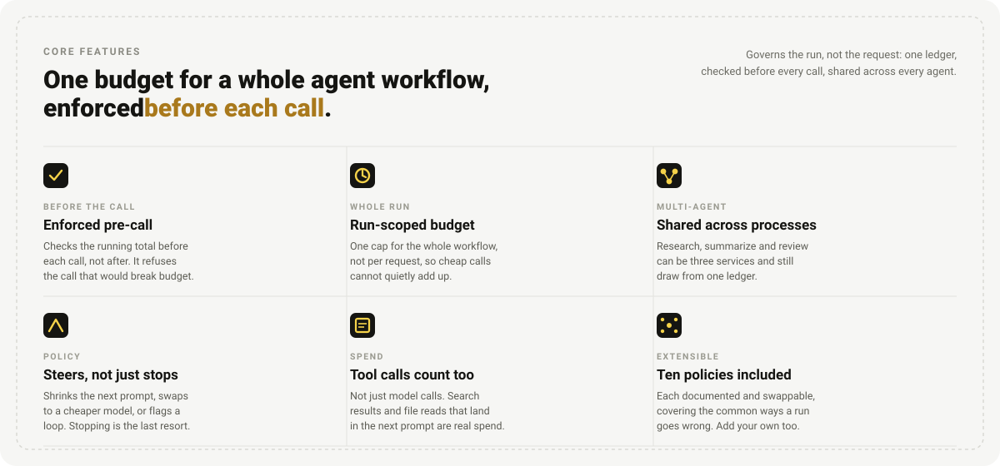
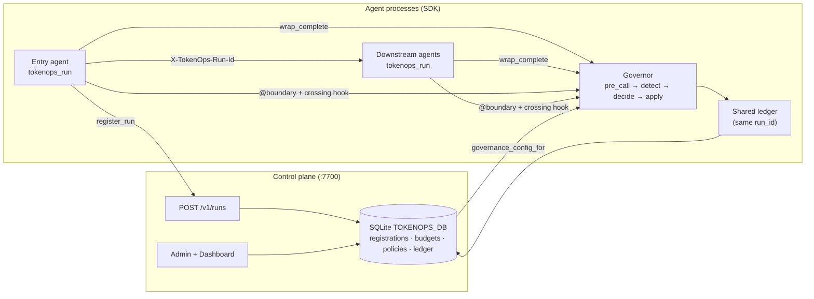

<div align="center">

# TokenOps

**Cuts wasted agent spend by up to 65%, checking the run's budget before every call.**<br>
<sub>Toward token governance as a first-class discipline, not an afterthought.</sub>

[](https://pypi.org/project/agent-tokenops/)
[](https://pepy.tech/project/agent-tokenops)
[](LICENSE.txt)
[](https://github.com/theagentplane/tokenops/stargazers)
[](https://www.linkedin.com/company/the-agent-plane/)
[](https://github.com/theagentplane/tokenops/discussions)

[](https://www.linkedin.com/posts/microsoft-developers_who-spent-all-the-tokens-tokenops-gives-activity-7499191980715982848-224b)
[](https://commandline.microsoft.com/tokenops-real-time-run-scoped-cost-control-ai-agents/)
[](https://www.youtube.com/watch?v=GJX19pNhmSw)

<sub>Built by <b><a href="https://www.linkedin.com/in/susheemkoul/">Susheem Koul</a></b> and <b><a href="https://www.linkedin.com/in/tisha-chawla/">Tisha Chawla</a></b></sub>

<a href="https://github.com/theagentplane/tokenops/raw/main/examples/demo-assets/videos/02_governance_on_budget_cap.webm">

</a>

<sub><i>Governed Research → Summarize run: the budget cap halts spend mid-run, then the Dashboard attributes cost per agent. <a href="https://github.com/theagentplane/tokenops/raw/main/examples/demo-assets/videos/02_governance_on_budget_cap.webm">Full video</a>.</i></sub>

<br>

[Core features](#-core-features) · [Quickstart](#-quickstart) · [Quickdeploy](#-quickdeploy) · [How it compares](#-how-tokenops-compares) · [Policies](docs/policies/) · [Support](#-support) · [Contributing](#-open-to-contribution)

</div>

> ### 🙌 Open to contribution
>
> Token spend deserves the same first-class attention as compute or latency, and
> we are growing the community working on that. Policies, actuators, and the
> shared ledger are all open to extension. See
> **[CONTRIBUTING.md](CONTRIBUTING.md)** to get started.

## ✨ Core features

Cheap calls add up fast, and a per-request limit never sees it coming, since
it only ever checks one call at a time. TokenOps watches the whole run
instead: one budget, checked before every call, not after.



Ten policies ship configured in [`docs/policies/`](docs/policies/), and you can
add your own.

## 🚀 Quickstart

Requires Python 3.10+.

### 1. Put it in your agent

**Skill (recommended).** Your coding assistant reads
[`SKILL.md`](.claude/skills/integrate-tokenops/SKILL.md), wires the one
enforcement point into your agent, and tells you what to check.

In **Claude Code**, from a clone:

```
/integrate-tokenops
```

Anywhere else (Cursor, Copilot, ...), paste this:

> Integrate TokenOps into this agent, following
> https://github.com/theagentplane/tokenops/blob/main/.claude/skills/integrate-tokenops/SKILL.md

<details>
<summary><b>Manual</b>, about ten lines</summary>

Wrap your model call once, then hand the wrapped version to your agent.

```python
from tokenops import ControlPlaneClient, tokenops_run
from tokenops.control import Halt, wrap_complete
from tokenops.providers import complete

client = ControlPlaneClient.from_env()

with tokenops_run(client=client, service="my-agent", intent="research",
                  provider="openai", model="gpt-4o") as bound:
    governed = wrap_complete(
        bound.governor, bound.controls, bound.attr,
        provider="openai", model="gpt-4o",
        dispatch=complete, service="my-agent",
    )
    try:
        agent.run(..., complete_fn=governed)   # <-- pass `governed`, not `complete`
    except Halt as stopped:
        print(f"run stopped: {stopped}")
```

Pass `governed` to your agent instead of `complete`; nothing else changes.
`wrap_complete` checks the budget before each call and raises `Halt` when the
run is out, even from another process.

</details>

### 2. When you need more

| You want to | Go to |
|---|---|
| Change the budget | [Set the budget](.claude/skills/integrate-tokenops/SKILL.md#set-the-budget) |
| One budget across several agent processes | [Shared plane](.claude/skills/integrate-tokenops/SKILL.md#tier-2--several-processes-one-budget) |
| FastAPI or A2A services | [Instrumented app](.claude/skills/integrate-tokenops/SKILL.md#tier-3--fastapi--a2a) |
| Something other than stopping | [The ten policies](docs/policies/) |
| Cost per agent in a dashboard | [Quickdeploy](#-quickdeploy) |
| A worked end-to-end example | [Field guide](docs/guides/field-guide-add-tokenops.md) |
| Everything else | [Onboarding guide](docs/guides/onboarding.md) |

## 🐳 Quickdeploy

> [!TIP]
> The control plane (`python -m tokenops.server`) shares one budget across
> processes and powers the dashboard. A single-process agent doesn't need it
> running at all.

One command, plane + dashboard:

```bash
git clone https://github.com/theagentplane/tokenops && cd tokenops
docker compose --profile ui up --build
```

Plane: `localhost:7700/health` · Dashboard: `localhost:8501`. Plane only:
`docker compose up --build`. Details: [`docs/control-plane-deploy.md`](docs/control-plane-deploy.md).

<details>
<summary><b>Without Docker</b> (make)</summary>

```bash
git clone https://github.com/theagentplane/tokenops && cd tokenops
make install
make run          # control plane :7700 + Admin/Dashboard :8501
```

Then open `localhost:8501` to see spend and governance per agent.

</details>

<details>
<summary><b>Multi-agent benches</b>: watch one budget span several agents</summary>

Each is a real multi-agent stack sharing one run ledger. One target starts the
plane, the agents, and the Admin UI.

| Bench | Agents | Run |
|---|---|---|
| Two-agent | Research to Summarize | `make demo` |
| Triad | Planner to Researcher to Writer | `make demo-triad` |
| Brief | Scout to Analyst to Editor (LangChain) | `make demo-brief` |
| Bench UI | Chat + Simulator only | `make bench-ui` |

`cp .env.example .env` first if you want them to call real models. See
[`examples/README.md`](examples/README.md) for the bench profiles.

</details>

<details>
<summary><b>Pointing several processes at one plane</b></summary>

```bash
export TOKENOPS_URL=http://localhost:7700
export TOKENOPS_DB=tokenops.db   # plane and every agent read the same file
```

> `TOKENOPS_EMBEDDED=1` overrides `TOKENOPS_URL`. Leave it unset here, or each
> process silently falls back to its own local ledger and gets the full budget.

PyPI name is `agent-tokenops`; the import is `tokenops`. Extras:
`pip install "agent-tokenops[examples]"` for the LangChain benches,
`".[dev,examples]"` from source. Releases: [`RELEASING.md`](RELEASING.md).

</details>

## 🆚 How TokenOps compares

TokenOps is not a gateway or a tracing dashboard. It governs the **run**, a full agent workflow, and sits alongside the tools you already use for routing and observability.

| | TokenOps | LiteLLM / Portkey / AI Gateway | Langfuse |
|---|:---:|:---:|:---:|
| Primary focus | Run (stateful) | Request | Trace (observe) |
| Multi-agent workflow as one unit | ✅ | ❌ | 🟡 manual stitch |
| Budget enforcement in-path | ✅ run-aware | ✅ key/team | ❌ analytics only |
| Steer next call (mutate / inject) | ✅ | 🟡 routing/fallbacks | ❌ |
| Shared ledger across agent processes | ✅ | — | — |

What this does **not** do: replace your LLM gateway, replace Chronicle-style record-and-replay, or host a SaaS control plane for you.

Longer table with logos: [`docs/product/comparison.md`](docs/product/comparison.md).

## Reference

Things you will want eventually, not now.

<details>
<summary><b>Architecture: how the plane and the SDK split the work</b></summary>

TokenOps is two layers that share one artifact, the **run**: a control plane that registers runs and stores budgets/policies, and an in-process SDK that enforces at every boundary crossing.



| Piece | Owns | Does not own |
|---|---|---|
| **Control plane** (`python -m tokenops.server`) | `POST /v1/runs`, shared SQLite, Admin/Dashboard | Agent loops, LLM calls, tools |
| **SDK (in agents)** | `tokenops_run`, `wrap_complete`, ledger/policies, Chronicle crossing hook | Ad-hoc run IDs; mounting `/v1/runs` when `TOKENOPS_URL` is set |

Chronicle records decision boundaries; TokenOps attaches as the cost/governance observer on live crossings. See [Chronicle](https://github.com/theagentplane/chronicle) for record-and-replay.

</details>

<details>
<summary><b>Environment variables</b></summary>

| Variable | Purpose |
|---|---|
| `TOKENOPS_URL` | Remote plane base URL (e.g. `http://localhost:7700`) → HTTP `register_run` |
| `TOKENOPS_EMBEDDED` | Set to `1` to force in-process `Store` (tests / single-process) |
| `TOKENOPS_DB` | SQLite path shared by plane + agents |
| `TOKENOPS_CONFIG` | YAML for governance seed (core: `src/tokenops/config/default.yaml`) |

`TOKENOPS_URL` also accepts the aliases `CONTROL_PLANE_URL` and
`TOKENOPS_CONTROL_PLANE_URL`.

Production / multi-process: set `TOKENOPS_URL`; agents must **not** mount `/v1/runs`. Tests: `TOKENOPS_EMBEDDED=1` (or omit URL).

> **Precedence.** `ControlPlaneClient.from_env` takes the HTTP path only when a
> URL is set **and** `TOKENOPS_EMBEDDED` is not `1`. Setting both falls back to a
> local SQLite file with no warning, and every process then gets its own full
> budget. Check with
> `print("embedded" if client.embedded else client.url)`.

</details>

<details>
<summary><b>Make targets</b></summary>

| Target | Role |
|--------|------|
| `make install` | Editable install with dev + examples extras |
| `make dist` / `check-dist` | Build sdist+wheel / `twine check` |
| `make control-plane` | Standalone plane (`python -m tokenops.server`) on `:7700` |
| `make ui` | Admin + Dashboard on `:8501` |
| `make run` | Plane + Admin/Dashboard |
| `make demo-quick` | `python -m tokenops.demo`: no API keys, no server |
| `make demo` / `demo-triad` / `demo-brief` | Runnable A2A stacks |
| `make bench-ui` | Chat + Simulator |
| `make db-reset` | Clear SQLite + reseed from `TOKENOPS_CONFIG` |
| `make stop` | Kill listeners on `:7700` / `:8501` |
| `make sync-skills` | Regenerate the editor copies of the integration skill |

</details>

<details>
<summary><b>Project structure</b></summary>

Only `src/tokenops/` is the installable package. Demos and benches stay under `examples/`.

```
src/tokenops/              # installable package
├── server/                # control plane (:7700, POST /v1/runs)
├── control/               # SDK: ledger, policies, wrap_complete, crossing hook
├── providers/             # OpenAI / Anthropic complete dispatch
├── config/                # default.yaml governance seed
└── ui/                    # Admin + Dashboard (Streamlit)
examples/                  # A2A benches (two-agent, triad, brief) + Chat/Simulator
benchmarking/              # MetaGPT / browser-use live harness
docs/                      # architecture, policies, guides, product
tests/                     # unit + e2e
```

</details>

<details>
<summary><b>More documentation</b></summary>

- [Onboarding](docs/guides/onboarding.md): prereqs, minimum integration, FAQ, current limits
- [Field guide](docs/guides/field-guide-add-tokenops.md): a triad walked through, with screenshots
- [Policies](docs/policies/): one page per policy
- [Run attribution](docs/run-attribution.md) - [control plane deploy](docs/control-plane-deploy.md) - [status](docs/control-plane-status.md)
- [Examples](examples/README.md) - [comparison](docs/product/comparison.md) - [shared ledger](docs/product/shared-ledger.md)

</details>

## 📰 Talks & press

- **Featured by Microsoft Developer**: “Who spent all the tokens?” on
  [LinkedIn](https://www.linkedin.com/posts/microsoft-developers_who-spent-all-the-tokens-tokenops-gives-activity-7499191980715982848-224b) and [X](https://x.com/msdev/status/2093425027500978292).
- **[Who spent all the tokens? Real-time, run-scoped cost control for AI agents](https://commandline.microsoft.com/tokenops-real-time-run-scoped-cost-control-ai-agents/)**: *Command Line*, a Microsoft publication.
- **[FinOps for AI Agents: Who Spent All the Tokens?](https://www.youtube.com/watch?v=GJX19pNhmSw)**: talk at the **AI Engineer World's Fair**, San Francisco.

## 🛟 Support

| Need | Where |
|---|---|
| Bug | [Open an issue](https://github.com/theagentplane/tokenops/issues) |
| Security issue | [SECURITY.md](SECURITY.md) |
| Real-time help | [Slack](https://join.slack.com/t/theagentplane/shared_invite/zt-47lqx2xtc-0idr1cuLNJ_JDTgqxDiUsg) |
| Longer-form discussion | [GitHub Discussions](https://github.com/theagentplane/tokenops/discussions) |
| Talk it through | [Office hours](https://calendly.com/theagentplane/theagentplane) |
| Talks & writing | [theagentplane.github.io/media](https://theagentplane.github.io/media.html) |

## Contributors

Thanks to everyone who has contributed.

[](https://github.com/theagentplane/tokenops/graphs/contributors)

---

<div align="center">

[Back to top](#tokenops)

</div>
