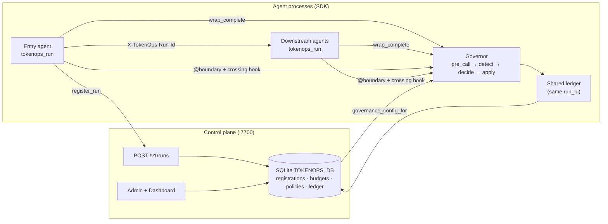

<div align="center">

# TokenOps

**Run-aware token governance for multi-agent systems.**<br>
Cap spend and steer behavior across a whole agent workflow, not per request, with a shared ledger and in-path enforcement.

[](https://github.com/theagentplane/tokenops/actions/workflows/ci.yml)
[](https://pypi.org/project/agent-tokenops/)
[](https://pypi.org/project/agent-tokenops/)
[](LICENSE.txt)
[](https://theagentplane.github.io/media.html)
[](https://github.com/theagentplane/tokenops/discussions)
[](https://join.slack.com/t/theagentplane/shared_invite/zt-47lqx2xtc-0idr1cuLNJ_JDTgqxDiUsg)

[](https://www.linkedin.com/posts/microsoft-developers_who-spent-all-the-tokens-tokenops-gives-activity-7499191980715982848-224b)
[](https://commandline.microsoft.com/tokenops-real-time-run-scoped-cost-control-ai-agents/)
[](https://www.youtube.com/watch?v=GJX19pNhmSw)

<br>

Built by <b><a href="https://www.linkedin.com/in/susheemkoul/">Susheem Koul</a></b> and <b><a href="https://www.linkedin.com/in/tisha-chawla/">Tisha Chawla</a></b>

<a href="https://github.com/theagentplane/tokenops/raw/main/examples/demo-assets/videos/02_governance_on_budget_cap.webm">

</a>

<sub><i>Governed Research → Summarize run: the budget cap halts spend mid-run, then the Dashboard attributes cost per agent. <a href="https://github.com/theagentplane/tokenops/raw/main/examples/demo-assets/videos/02_governance_on_budget_cap.webm">Full video</a>.</i></sub>

</div>

<br>

## Start here

### 1. See it work

```bash
pip install agent-tokenops
python -m tokenops.demo
```

No API keys, no server, no Docker. It runs the same agent loop twice:

```
An agent makes 40 model calls. Budget for the whole run: $2.00.

  without TokenOps   40 calls run, spend $5.80
  with TokenOps      halted at call 12, spend $2.03

  $3.77 not spent. The run stopped itself.
```

No single call was expensive. Together they crossed the cap, which is what a
per-request limit cannot see.

### 2. Put it in your agent

Ten lines. Wrap your model call once, then pass the wrapped version to your agent.

```python
from tokenops import ControlPlaneClient, tokenops_run
from tokenops.control import Halt, wrap_complete
from tokenops.providers import complete

client = ControlPlaneClient.from_env()

with tokenops_run(client=client, service="my-agent", intent="research",
                  provider="openai", model="gpt-4o") as bound:
    governed = wrap_complete(
        bound.governor, bound.controls, bound.attr,
        provider="openai", model="gpt-4o",
        dispatch=complete, service="my-agent",
    )
    try:
        agent.run(..., complete_fn=governed)   # <-- pass `governed`, not `complete`
    except Halt as stopped:
        print(f"run stopped: {stopped}")
```

**The only change to your agent is that last line.** If your agent hard-codes its
model client, make the completion function injectable. Everything else stays as it is.

`wrap_complete` checks the budget *before* each call and records the cost after.
When the run is out of budget it raises `Halt`, and later calls on the same run are
refused, even from another process.

Would rather not hand-wire it? Point Claude Code, Cursor, or Copilot at your agent:

> Integrate TokenOps into this agent using
> https://github.com/theagentplane/tokenops/blob/main/.claude/skills/integrate-tokenops/SKILL.md

### 3. When you need more

| You want to | Go to |
|---|---|
| Change the budget from $2.00 | [Set the budget](.claude/skills/integrate-tokenops/SKILL.md#set-the-budget) |
| One budget across several agent processes | [Shared plane](.claude/skills/integrate-tokenops/SKILL.md#tier-2--several-processes-one-budget) |
| FastAPI or A2A services | [Instrumented app](.claude/skills/integrate-tokenops/SKILL.md#tier-3--fastapi--a2a) |
| Cost per agent in a dashboard | [Run it locally](#run-it-locally) |
| Something else to happen instead of stopping | [Policies](docs/policies/) |

---

## Why TokenOps

**The problem.** Your agent workflow calls a model twenty times. Each call is
cheap and each one passes whatever per-request limit you set. The workflow still
costs ten times what you expected, and nothing stopped it, because nothing was
counting the workflow as one thing.

**What TokenOps does.** It gives the whole workflow one budget and one running
total, and it checks that total *before* each call rather than reporting on it
afterwards. Cross the budget and the run stops.

A few things follow from that:

- **It works across processes.** Research, summarize and review can be three
  separate services and still share one budget. Without that, each one gets the
  full cap and you pay three times over.
- **Stopping is not the only option.** A policy can also shrink the next prompt,
  swap to a cheaper model, or tell the agent it is going in circles. Stopping is
  the last resort, not the only tool.
- **Tool calls count too.** Not just model calls. Search results and file reads
  end up in the next prompt, and that is real spend.
- **It is not a dashboard.** Analytics tell you what you already spent. This
  refuses the call that would break the budget.

Ten policies ship configured. You can [add your own](docs/policies/).

## Architecture

TokenOps is two layers that share one artifact, the **run**: a control plane that registers runs and stores budgets/policies, and an in-process SDK that enforces at every boundary crossing.



| Piece | Owns | Does not own |
|---|---|---|
| **Control plane** (`python -m tokenops.server`) | `POST /v1/runs`, shared SQLite, Admin/Dashboard | Agent loops, LLM calls, tools |
| **SDK (in agents)** | `tokenops_run`, `wrap_complete`, ledger/policies, Chronicle crossing hook | Ad-hoc run IDs; mounting `/v1/runs` when `TOKENOPS_URL` is set |

Chronicle records decision boundaries; TokenOps attaches as the cost/governance observer on live crossings. See [Chronicle](https://github.com/theagentplane/chronicle) for record-and-replay.

## Run it locally

The plane, the Admin/Dashboard UI, and the seeded policies, from a clone:

```bash
make install                     # editable install with dev + examples extras
cp .env.example .env             # optional: API keys for the demos below
make run                         # control plane :7700 + Admin/Dashboard :8501
```

Point agent processes at that plane so they share one budget:

```bash
export TOKENOPS_URL=http://localhost:7700
export TOKENOPS_DB=tokenops.db   # plane and every agent read the same file
```

> `TOKENOPS_EMBEDDED=1` overrides `TOKENOPS_URL`. Leave it unset here, or each
> process silently falls back to its own local ledger and gets the full budget.

PyPI name is `agent-tokenops`; the import is `tokenops`. Extras:
`pip install "agent-tokenops[examples]"` for the LangChain benches,
`".[dev,examples]"` from source. Releases: [`RELEASING.md`](RELEASING.md).

### Multi-agent benches

Each is a real multi-agent stack sharing one run ledger, so you can watch a
single budget span several agents. One target starts the plane, the agents and
the Admin UI.

| Bench | Agents | Run |
|---|---|---|
| Two-agent | Research to Summarize | `make demo` |
| Triad | Planner to Researcher to Writer | `make demo-triad` |
| Brief | Scout to Analyst to Editor (LangChain) | `make demo-brief` |
| Bench UI | Chat + Simulator only | `make bench-ui` |

Docker instead of make: `docker compose up --build`, and see
[`docs/control-plane-deploy.md`](docs/control-plane-deploy.md) for the UI and
two-agent profiles. More on the benches: [`examples/README.md`](examples/README.md).

## How TokenOps compares

TokenOps is not a gateway or a tracing dashboard. It governs the **run**, a full agent workflow, and sits alongside the tools you already use for routing and observability.

| | TokenOps | LiteLLM / Portkey / AI Gateway | Langfuse |
|---|:---:|:---:|:---:|
| Primary focus | Run (stateful) | Request | Trace (observe) |
| Multi-agent workflow as one unit | Yes | No | Manual stitch |
| Budget enforcement in-path | Yes (run-aware) | Yes (key/team) | No (analytics) |
| Steer next call (mutate / inject) | Yes | Routing / fallbacks | No |
| Shared ledger across agent processes | Yes | N/A | N/A |

What this does **not** do: replace your LLM gateway, replace Chronicle-style record-and-replay, or host a SaaS control plane for you.

Longer table with logos: [`docs/product/comparison.md`](docs/product/comparison.md).

## Make targets

<details>
<summary>Command reference</summary>

| Target | Role |
|--------|------|
| `make install` | Editable install with dev + examples extras |
| `make dist` / `check-dist` | Build sdist+wheel / `twine check` |
| `make control-plane` | Standalone plane (`python -m tokenops.server`) on `:7700` |
| `make ui` | Admin + Dashboard on `:8501` |
| `make run` | Plane + Admin/Dashboard |
| `make demo-quick` | `python -m tokenops.demo`: no API keys, no server |
| `make demo` / `demo-triad` / `demo-brief` | Runnable A2A stacks |
| `make bench-ui` | Chat + Simulator |
| `make db-reset` | Clear SQLite + reseed from `TOKENOPS_CONFIG` |
| `make stop` | Kill listeners on `:7700` / `:8501` |
| `make sync-skills` | Regenerate the editor copies of the integration skill |

</details>

## Environment variables

| Variable | Purpose |
|---|---|
| `TOKENOPS_URL` | Remote plane base URL (e.g. `http://localhost:7700`) → HTTP `register_run` |
| `TOKENOPS_EMBEDDED` | Set to `1` to force in-process `Store` (tests / single-process) |
| `TOKENOPS_DB` | SQLite path shared by plane + agents |
| `TOKENOPS_CONFIG` | YAML for governance seed (core: `src/tokenops/config/default.yaml`) |

`TOKENOPS_URL` also accepts the aliases `CONTROL_PLANE_URL` and
`TOKENOPS_CONTROL_PLANE_URL`.

Production / multi-process: set `TOKENOPS_URL`; agents must **not** mount `/v1/runs`. Tests: `TOKENOPS_EMBEDDED=1` (or omit URL).

> **Precedence.** `ControlPlaneClient.from_env` takes the HTTP path only when a
> URL is set **and** `TOKENOPS_EMBEDDED` is not `1`. Setting both falls back to a
> local SQLite file with no warning, and every process then gets its own full
> budget. Check with
> `print("embedded" if client.embedded else client.url)`.

## Project structure

Only `src/tokenops/` is the installable package. Demos and benches stay under `examples/`.

```
src/tokenops/              # installable package
├── server/                # control plane (:7700, POST /v1/runs)
├── control/               # SDK: ledger, policies, wrap_complete, crossing hook
├── providers/             # OpenAI / Anthropic complete dispatch
├── config/                # default.yaml governance seed
└── ui/                    # Admin + Dashboard (Streamlit)
examples/                  # A2A benches (two-agent, triad, brief) + Chat/Simulator
benchmarking/              # MetaGPT / browser-use live harness
docs/                      # architecture, policies, guides, product
tests/                     # unit + e2e
```

## Roadmap

TokenOps is early (0.x). Near-term:

- User/tag segment-scoped budgets (machinery exists; seed is run-only today).
- Optional fail-closed integrity: refuse on missing registration or exceeded budget.
- Remote observe / decide (fatter plane) for multi-host stacks.
- Documentation site.

Status of each control-plane job: [`docs/control-plane-status.md`](docs/control-plane-status.md).

## Documentation

- [Onboarding](docs/guides/onboarding.md): prereqs, bare-min integrate, FAQ, current limits
- [Field guide](docs/guides/field-guide-add-tokenops.md): triad deep dive + screenshots
- [Control plane status](docs/control-plane-status.md)
- [Architecture](docs/architecture.md)
- [Run attribution](docs/run-attribution.md)
- [Control plane deploy](docs/control-plane-deploy.md)
- [Examples](examples/README.md)
- [Product: comparison](docs/product/comparison.md) · [shared ledger](docs/product/shared-ledger.md)

## Talks & press

- **Featured by Microsoft Developer**: “Who spent all the tokens?” on
  [LinkedIn](https://www.linkedin.com/posts/microsoft-developers_who-spent-all-the-tokens-tokenops-gives-activity-7499191980715982848-224b) and [X](https://x.com/msdev/status/2093425027500978292).
- **[Who spent all the tokens? Real-time, run-scoped cost control for AI agents](https://commandline.microsoft.com/tokenops-real-time-run-scoped-cost-control-ai-agents/)**: *Command Line*, a Microsoft publication. Why per-request caps miss agent workflows, and how a run-scoped ledger plus in-path enforcement stops the bill mid-run.
- **[FinOps for AI Agents: Who Spent All the Tokens?](https://www.youtube.com/watch?v=GJX19pNhmSw)**: talk at the **AI Engineer World's Fair**, San Francisco. Live walkthrough of a governed multi-agent run hitting its budget cap.

## Community

**[Join The Agent Plane on Slack](https://join.slack.com/t/theagentplane/shared_invite/zt-47lqx2xtc-0idr1cuLNJ_JDTgqxDiUsg)**
for real-time questions, integration help, and demos of what you have governed.

For longer-form questions, ideas, and show-and-tell, use
[GitHub Discussions](https://github.com/theagentplane/tokenops/discussions).

**Office hours:** if you are wiring TokenOps into a real stack and want to talk it
through, [book a slot](https://calendly.com/theagentplane/theagentplane).

**Writing, talks and videos** from the people building this, on agent
observability, replay testing, and token infrastructure:
**[theagentplane.github.io/media](https://theagentplane.github.io/media.html)**.

## Contributing

Good first contributions are labelled
[`good first issue`](https://github.com/theagentplane/tokenops/issues?q=is%3Aissue+is%3Aopen+label%3A%22good+first+issue%22)
and [`help wanted`](https://github.com/theagentplane/tokenops/issues?q=is%3Aissue+is%3Aopen+label%3A%22help+wanted%22).
Two areas take contributions without touching the core:

- **A new policy** (a detector plus a decision) under `src/tokenops/control/policies/`.
  Ten existing ones are working references, one doc each in [`docs/policies/`](docs/policies/).
- **A new adapter** so another SDK can be governed, under `src/tokenops/adapters/`.

Bugs belong in Issues. Open an issue before a pull request so the approach can
be agreed there first; typos and small docs fixes can go straight to a PR. See
[CONTRIBUTING.md](CONTRIBUTING.md), [CODE_OF_CONDUCT.md](CODE_OF_CONDUCT.md),
and [SECURITY.md](SECURITY.md).

```bash
make install
make lint
make test
```

## Contributors

Thanks to everyone who has contributed.

[](https://github.com/theagentplane/tokenops/graphs/contributors)

---

If TokenOps saves you a runaway agent bill, please [⭐ star the repo](https://github.com/theagentplane/tokenops) so more people can find it.

<div align="center">

[Slack](https://join.slack.com/t/theagentplane/shared_invite/zt-47lqx2xtc-0idr1cuLNJ_JDTgqxDiUsg) · [Discussions](https://github.com/theagentplane/tokenops/discussions) · [PyPI](https://pypi.org/project/agent-tokenops/)

</div>
