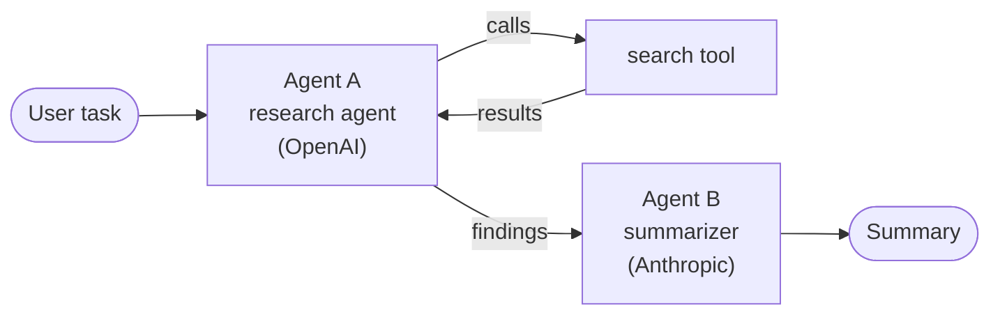

# Token Governance for AI Agents

> A field guide to treating tokens as a first-class operational resource.

> **TL;DR.** AI agents spend tokens to think, and how many they spend is nondeterministic. The same task can cost wildly different amounts across runs, and a stuck recursive loop can spend without limit while still looking successful. You cannot budget a nondeterministic resource up front. You have to **observe** it, **attribute** it, and **enforce** limits at runtime, from a control loop kept separate from the agent.

---

## Contents

1. [First principles](#0-first-principles)
2. [The problem](#1-the-problem)
3. [Primitives for token governance](#2-primitives-for-token-governance)
4. [The current space](#3-the-current-space)
5. [The discipline](#4-the-discipline)

---

## 0. First principles

Start from what is provably true, then build up.

1. **A token is a metered unit of a paid resource.** Every model call consumes a countable number of tokens at a published price.[^1][^5]
2. **Consumption is nondeterministic.** Token generation is stochastic: at each step the model samples the next token from a probability distribution, so the same prompt can return a different completion, and a different number of output tokens, on every run. OpenAI states its APIs are nondeterministic by default, and that determinism is not guaranteed even with a fixed seed.[^3] Agents amplify this. An agent picks its next action from that nondeterministic output, so the number of reasoning steps and tool calls, and therefore the total token spend, is a random variable, not a fixed cost.
3. **You can only govern what you can measure, attribute, and bound.** Measure it (how many), attribute it (whose), bound it (a ceiling that actually holds).
4. **You cannot bound it by prediction.** A static estimate set in advance is wrong on the tail. The only bound that holds is enforced at runtime: watch spend as it accrues, and stop the run when it crosses a limit.
5. **The bound must sit outside the agent.** An agent chooses its own next call, so nothing in its own logic is guaranteed to stop it. Governance is an external control loop around the agent, not a feature inside it.

> **The three questions that decide whether you govern token spend:**
> 1. How many tokens did this run spend? *(measure)*
> 2. Who spent them: which user, which agent, which run? *(attribute)*
> 3. What stops a run before the invoice does? *(bound)*
>
> If you cannot answer all three, you are observing spend after the fact, not governing it.

---

## 1. The problem

> **One example, used throughout.** Agent A is a research agent: it calls a `search` tool, reads the results, and hands findings to Agent B, a summarizer. Agent A runs on OpenAI, Agent B on Anthropic. We follow this single task through every failure mode below.

**What a token is.** A token is a chunk of text mapped to an integer ID from the model's fixed vocabulary. A subword tokenizer (for example, byte-pair encoding) splits text into these pieces, so one token can be a whole word, part of a word, or a single character.[^1][^2] Different models use different tokenizers, so the same sentence is a different token count on each. Rule of thumb in English: roughly 4 characters, or 0.75 words, per token.[^1] Output tokens cost several times more than input tokens.[^4][^5]

**Why tokens became an ops problem.** Agents do not make one call, they loop. Anthropic measured agents using about **4x** the tokens of a chat, and multi-agent systems about **15x**, with token usage alone explaining roughly **80%** of the variance in cost.[^6] In our example, Agent A might call `search` once, or twenty times. You do not know which until it runs.

### 1.1 The token leak

Agent A calls `search("pricing")`. The result is weak, so it feeds its own output back in and calls `search("pricing")` again, and again. This is a **recursive loop**: the agent keeps invoking the same step because nothing tells it to stop. Fifty calls later it still returns a clean summary, so every functional dashboard shows success. The spend shows up in exactly one place: **the bill**.

That is a **token leak**: spend that grows with no bound and no attribution, whether from a silent retry loop, a context window that keeps growing, or an unflagged model upgrade. Provider guardrails do not catch it: OpenAI project budgets are alerts, not hard caps.[^7] Unmanaged, this is now a top failure mode. Gartner predicts over **40% of agentic AI projects will be canceled by end of 2027**, citing escalating cost.[^8]

**The quieter leak: cache busting.** Repeated input can be cached at a steep discount: OpenAI documents 50% off cached input,[^4] and Anthropic charges roughly 90% below base input for cache reads.[^5] The catch: caching matches the prompt **from the top down**, only up to the first point where the text differs. If Agent A pastes a `current_timestamp` or `session_id` near the top of its system prompt, it throws away the cache for everything below it, and a large context that should cost a tenth of full price pays full price every turn. Same text, same step count, **10x the bill**. The fix is structural: put static content (system prompt, tool definitions) first and volatile values last, and treat a drop in cache hit rate as a spend alarm on its own.[^4]

**A third leak: reasoning bloat.** Reasoning models (OpenAI's o-series and GPT-5 reasoning, Anthropic extended thinking) spend hidden reasoning tokens server-side before emitting a single visible token, and those tokens are billed.[^18] Two consequences. First, `max_output_tokens` caps the *sum* of reasoning and visible output,[^18] so a runaway reasoning loop can burn the entire budget inside one call without returning a character. Second, if your breaker trips by parsing the output stream, it is blind during the thinking phase: the spend has already happened before the first chunk arrives. Read the usage totals the model reports, not just the visible stream.

### 1.2 Distributed token lineage

The monthly bill arrives: one total from OpenAI, one from Anthropic. Neither number tells you that Agent A's recursive loop caused most of the cost, or which user started the run. **Lineage** is the missing label on every call: which user, which agent (A or B), and which run produced it. OpenTelemetry's GenAI conventions define exactly these attributes: `gen_ai.usage.input_tokens`, `gen_ai.usage.output_tokens`, plus agent and session identifiers.[^9] Recent versions also add attributes for the costly hidden categories, cached and reasoning tokens, mirroring the provider payloads: OpenAI's `prompt_tokens_details.cached_tokens` and `completion_tokens_details.reasoning_tokens`, and Anthropic's `cache_read_input_tokens`.[^9] Track those, or your lineage misses exactly the tokens most likely to surprise you.

One more catch: Agent A's OpenAI tokens and Agent B's Anthropic tokens are **not the same unit**, because the tokenizers and prices differ. You cannot add raw tokens across providers. Convert each call to **cost** first (one denominator, such as micro-dollars), then sum and enforce. Enforce on cost, not tokens.

### 1.3 Isolate the guard

Put the budget check inside Agent A's loop and two things break: the same bug that makes it loop can skip the check, and Agent B needs its own copy. So keep two planes apart:

- **Data plane**: the agent doing the work.
- **Control plane**: the code that meters, attributes, and halts spend.

The meter and the limit live in the control plane, an out-of-band loop both agents call but neither can edit or bypass.

---

## 2. Primitives for token governance

Six building blocks. Each answers one question. Together they are the vocabulary for everything below.

| Primitive | What it is | Question it answers | Source |
|---|---|---|---|
| **Meter** | Counts tokens and cost on every call | How much did this consume? | [^10] |
| **Attribution context** | Tags every call with user, agent, run | Whose spend is this? | [^9] |
| **Budget / quota** | A hard ceiling on tokens or cost over a window | What is the cap, and does it hold? | [^12][^13] |
| **Rate limit** | A cap on tokens or requests per unit time | How fast is too fast? | [^14] |
| **Circuit breaker** | Trips and fails fast when a condition crosses a threshold | What stops a bad run immediately? | [^11] |
| **Control plane** | Where the rules live, out of band from the agent | Who owns the decision? | §1.3 |

**The circuit breaker, precisely.** You wrap a protected call in an object that monitors it. When a chosen condition crosses a threshold, the breaker trips to an *open* state and fails fast, returning an error without making the call. Classic breakers add a *half-open* state to probe recovery.[^11] A failure can be any condition you define, such as a timeout or an HTTP 429. For token governance, the condition is behavioral: a repeated action, a spend velocity, or a collapse in cache hit rate. The breaker trips to halt the run before the spend lands.

**How a behavioral check actually works.** You do not need brittle, domain-specific rules. Three system-level signals over an agent's step history cover most runaway modes:

- **Semantic loop.** Hash each tool call's name and arguments, and trip when the same signature repeats inside a sliding window. A vector-similarity check on consecutive prompts catches near-duplicates, such as an agent feeding the same error back to a tool.
- **Spend velocity.** Track cost per step (the derivative of cost over steps). A sharp spike means the context is compounding, for example appending full raw logs on every failed turn.
- **Efficiency decay.** Watch the ratio of progress made to tokens burned. This one is the most heuristic and hardest to define cleanly, so treat it as a warning, not a hard trip.

The first two are cheap and robust. Start there.

### 2.1 Beyond halt: two richer responses

Halting is the simplest response to a trip, not the only one. Two production patterns are worth knowing, each with a caveat.

- **Model cascade (graceful degradation).** At a warning threshold (say 75% of a session budget), the control plane swaps the next call to a cheaper model and trims non-essential tools, trying a low-cost completion before any hard halt. This ships today: Cloudflare can switch to a cheaper model once a budget is exhausted,[^13] and gateways like LiteLLM support model fallbacks.[^12] **Caveat:** a weaker model can reason worse and loop more, trading a hard failure for a quality risk and sometimes more spend. It is a tradeoff, not a free win.
- **Escrow and human-in-the-loop.** Instead of killing the run, the control plane suspends it, snapshots its state, and pings a human to inspect and resume. Real, but not free: pause-and-resume requires a durable, checkpointable runtime. LangGraph, for example, requires a checkpointer to persist state across an interrupt.[^17] A lightweight in-process wrapper cannot serialize and resume an arbitrary call stack on its own.

---

## 3. The current space

### 3.1 Five dimensions

Score every tool on five questions. The first three are table stakes. The last two are where the gap is.

| Dimension | Primitive | Question | Source |
|---|---|---|---|
| **Observe** | Meter | Can you see tokens per call? | [^9][^10] |
| **Attribute** | Attribution context | Whose spend: user, agent, run? | [^16] |
| **Enforce** | Budget, rate limit | Can you stop spend in real time? | [^12][^13] |
| **Behavioral** | Circuit breaker | Can you halt on a runaway pattern, not just a dollar line? | [^6][^15] |
| **Ownership** | Control plane | Which layer holds the control point? | §1.3 |

### 3.2 Five categories

Every tool sits at one of five layers in the stack.

| Layer | What it is | Examples | Stops spend? |
|---|---|---|---|
| **Provider** | Vendor-native limits | OpenAI, Anthropic, Azure OpenAI | Coarse, often alerts |
| **Gateway** | Out-of-process proxy you route through | LiteLLM, Portkey, Cloudflare, Kong | Yes, threshold-based |
| **Component** | In-process library inside your app | OpenLLMetry, LangChain callbacks | Rare |
| **Backend** | Collector or dashboard | Langfuse, Datadog, Arize, LangSmith | No, after the fact |
| **Standard** | The wire format everyone emits | OpenTelemetry GenAI conventions | n/a |

### 3.3 The gap

Across these tools, most **observe**, several **enforce** a dollar or rate threshold (the gateway layer is moving fast: Cloudflare shipped per-user spend limits in June 2026[^13]), but almost none **halt a run on pathological behavior** (a runaway loop) before the threshold is hit.

Enforcement also tends to live at the **gateway**, which sees a stream of independent requests, not the **in-process** context (the agent's step sequence and loop structure) needed to recognize a loop early. Behavioral signals like a collapsing cache hit rate or a semantic loop are easiest to read right next to the prompt structure and steps that caused them, which a gateway does not retain.

**In-process, behavioral enforcement is the least served square in the landscape today.**

---

## 4. The discipline

You already do this for CPU and memory. You measure it, label it, watch it, and cap it. Tokens are simply the newest resource to earn the same four steps. The order matters, because each step depends on the one before it: you cannot attribute what you never measured, and you cannot enforce what you cannot see.

| Step | In plain terms | What it does | Mechanism |
|---|---|---|---|
| **1. Instrument** | Meter it | Emit one record per model and tool call, carrying token counts | OpenTelemetry GenAI spans [^9] |
| **2. Attribute** | Tag it | Stamp every record with user, agent, and run | OTel attributes and vendor tags [^16] |
| **3. Surface** | Watch it | Stream the records so a climbing cost or a falling cache hit rate is visible live, not at month end | Observability backends [^16] |
| **4. Enforce** | Cap it | Apply a budget, a rate limit, or a behavioral circuit breaker that trips on a recursive loop | Budgets and breakers [^12][^11] |

Walk Agent A and Agent B through it:

1. **Instrument.** Every `search` call and every model call, on both OpenAI and Anthropic, emits a record with its token usage.
2. **Attribute.** Each record carries `agent=A` or `agent=B` and the run id, so the bill splits cleanly instead of arriving as one number.
3. **Surface.** Agent A's recursive search loop appears as a steeply climbing cost line the moment it starts, not four weeks later.
4. **Enforce.** When Agent A repeats the same `search` call past a set threshold, the breaker trips and halts the run before the spend lands.

All four steps live in the control plane (see 1.3), outside the agents, so neither Agent A nor Agent B can skip them.

The four verbs are a way to organize the work, not an official standard. Every mechanism they point to (spans, attributes, budgets, breakers) is real and documented in the footnotes.

---

[^1]: OpenAI, "What are tokens and how to count them." https://help.openai.com/en/articles/4936856-what-are-tokens-and-how-to-count-them
[^2]: OpenAI, "tiktoken" (open-source tokenizer). https://github.com/openai/tiktoken
[^3]: OpenAI, "Reproducible outputs with the seed parameter" (APIs are nondeterministic by default; determinism not guaranteed). https://developers.openai.com/cookbook/examples/reproducible_outputs_with_the_seed_parameter
[^4]: OpenAI, "Prompt Caching in the API" (input vs output pricing; cached-input discount). https://openai.com/index/api-prompt-caching/
[^5]: Anthropic, "Pricing" (base input vs output; cache-read pricing). https://platform.claude.com/docs/en/about-claude/pricing
[^6]: Anthropic, "How we built our multi-agent research system" (4x and 15x token multipliers; ~80% of cost variance). https://www.anthropic.com/engineering/multi-agent-research-system
[^7]: OpenAI, "Managing projects in the API platform" (project budgets are alerts, not hard caps). https://help.openai.com/en/articles/9186755-managing-projects-in-the-api-platform
[^8]: Gartner, "Over 40% of Agentic AI Projects Will Be Canceled by End of 2027" (June 25, 2025). https://www.gartner.com/en/newsroom/press-releases/2025-06-25-gartner-predicts-over-40-percent-of-agentic-ai-projects-will-be-canceled-by-end-of-2027
[^9]: OpenTelemetry, "Semantic conventions for generative AI" (status: Development). https://opentelemetry.io/docs/specs/semconv/gen-ai/
[^10]: OpenTelemetry, "Semantic conventions for generative AI metrics" (`gen_ai.client.token.usage`). https://opentelemetry.io/docs/specs/semconv/gen-ai/gen-ai-metrics/
[^11]: Martin Fowler, "CircuitBreaker" (popularizing Michael Nygard, *Release It!*). https://martinfowler.com/bliki/CircuitBreaker.html
[^12]: LiteLLM, "Budgets and Rate Limits." https://docs.litellm.ai/docs/proxy/users
[^13]: Cloudflare, "AI Gateway spend limits." https://blog.cloudflare.com/ai-gateway-spend-limits/
[^14]: Kong, "Token Rate-Limiting and Tiered Access for AI Usage." https://konghq.com/blog/engineering/token-rate-limiting-and-tiered-access-for-ai-usage
[^15]: Portkey, "Budget Limits." https://docs.portkey.ai/docs/product/ai-gateway/virtual-keys/budget-limits
[^16]: Helicone, "Cost Tracking." https://docs.helicone.ai/guides/cookbooks/cost-tracking
[^17]: LangChain, "Persistence" (LangGraph checkpointers; pause and resume require a checkpointer). https://docs.langchain.com/oss/python/langgraph/persistence
[^18]: OpenAI, "Reasoning models" (internal reasoning tokens are billed; `max_output_tokens` caps reasoning plus visible output). https://developers.openai.com/api/docs/guides/reasoning
