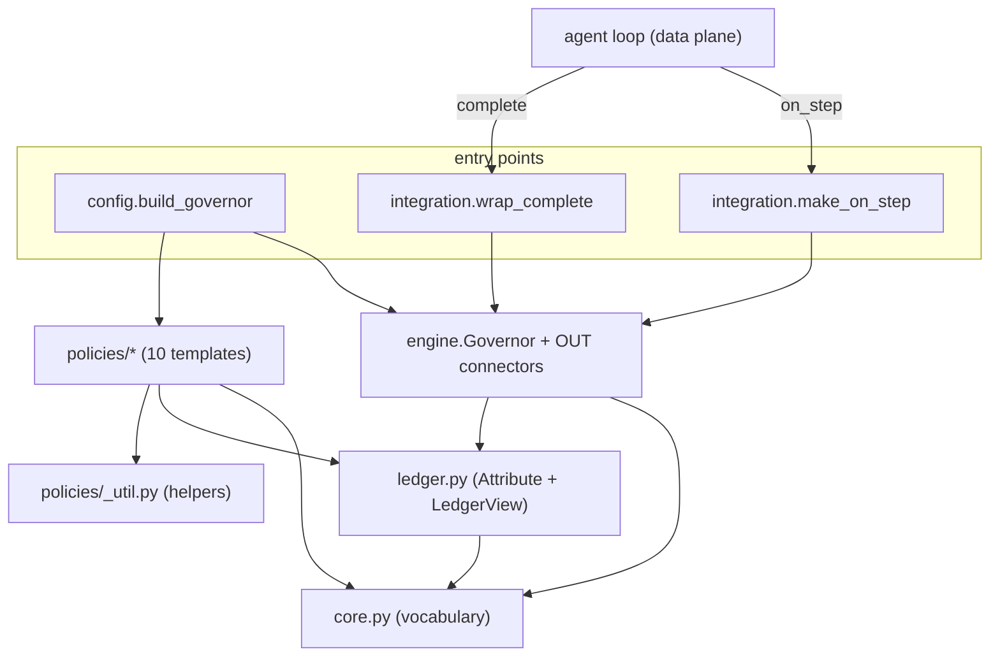

# TokenOps control plane — architecture & dependency graph

Where the code starts, how the modules depend on each other, and what each is for.
All under `tokenops-dev/src/tokenops/control/`.

---

## Starting points (what you call)

| Entry point | Module | Purpose |
|-------------|--------|---------|
| `build_governor(config, price)` | `config.py` | turn a declarative `budgets:`/`policies:` config into a wired `Governor` (+ its `Ledger`) |
| `make_on_step(governor, attr, …)` | `integration.py` | brownfield **IN** tap — adapt an agent's `StepEvent` to an `Observation` and feed `observe` |
| `wrap_complete(governor, controls, attr, …)` | `integration.py` | provider wrap — run **pre_call** and **apply** MUTATE/INJECT/REJECT before dispatch |

A host wires once with `build_governor`, then taps the agent with `make_on_step` (and
optionally `wrap_complete`). Everything else is internal.

## Static dependency graph (who imports whom)



Arrow = "depends on / imports". The graph is a **DAG that bottoms out at `core.py`** —
nothing imports upward, so the foundation has zero internal dependencies.

## Layers (bottom-up — each layer only knows the ones below)

| Layer | Module(s) | Purpose | Depends on |
|-------|-----------|---------|-----------|
| 5 (foundation) | `core.py` | the shared vocabulary: `Observation`→`BoundaryStep`, `Signal`, `Action`/`ActionKind`, `Detector`/`Policy`, `LedgerView` | — |
| 4 | `ledger.py` | the **Attribute** module + `LedgerView`: `runs/spent/inflight`, `record()`, `Budget`/`segment_key` (Design A: one source of spend) | core |
| 3 | `policies/_util.py` | deterministic, model-free helpers (edit distance, token estimate, n-gram, SimHash) | — |
| 3 | `policies/*.py` | the 10 `(Detector, Policy)` templates — one LLD row each, exposing `build()` | core, ledger, _util |
| 2 | `engine.py` | the **Enforce** harness `Governor` (3 moments) + OUT connectors `RaiseControls` / `ApplyControls` / `Throttled` | core, ledger |
| 1 | `config.py` | `build_governor` factory — maps config keys to template `build()`s | engine, ledger, policies |
| 1 | `integration.py` | brownfield IN tap + provider wrap | core (+ governor/ledger at runtime) |
| 0 (surface) | `control/__init__.py` | the public API re-export | all of the above |

## Runtime flow of one governed call

```
agent loop
  │
  ├─ complete(...)  ──[wrap_complete]──▶ Governor.pre_call(CallRequest)
  │       │                                 → Detector.pre_call → Policy.decide → controls.apply
  │       │                                   (MUTATE cap/model · REJECT→Throttled · HALT→raise)
  │       └─ dispatch the mutated call → providers.complete(..., max_output_tokens)
  │
  └─ on_step(StepEvent) ──[make_on_step]──▶ Governor.observe(Observation)
          → Ledger.record (price → spent → append BoundaryStep)
          → Detector.observe → Policy.decide → controls.apply
            (INJECT next message · HALT→raise Halt → unwinds the loop)
```

The **IN** side (`observe`) governs *after* each crossing; the **OUT** side (`pre_call` via
the wrap) governs *before* the next call. The Ledger is the single state both read.

## Design rule the graph encodes

Dependencies point **one way, downward**, and the **data plane never imports the control
plane's internals** — it only touches the two entry points (`make_on_step`, `wrap_complete`),
which duck-type the agent's objects. That is what keeps the agent vanilla and the control
plane swappable.
