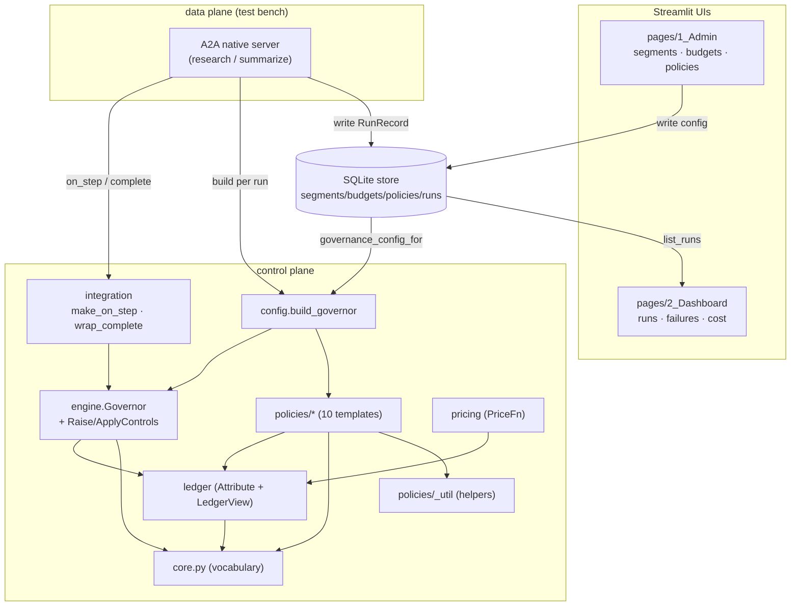

# TokenOps control plane — architecture & dependency graph

Where the code starts, how the modules depend on each other, and what each is for.
Control plane under `tokenops-dev/src/tokenops/control/`; wired into the A2A native servers
and two Streamlit UIs; state shared via one SQLite file.

---

## Starting points (what you call)

| Entry point | Module | Purpose |
|-------------|--------|---------|
| `build_governor(config, price)` | `config.py` | turn a `budgets:`/`policies:` config into a wired `Governor` (+ its `Ledger`) |
| `make_on_step(governor, attr, …)` | `integration.py` | brownfield **IN** tap — agent `StepEvent` → `Observation` → `observe` |
| `wrap_complete(governor, controls, attr, …)` | `integration.py` | provider wrap — run **pre_call** and **apply** MUTATE/INJECT/REJECT before dispatch |
| `Store(...)` + `governance_config_for(agent)` | `store.py` | SQLite-backed config + run history; assembles the exact `build_governor` dict |
| `build_price_book()` | `pricing.py` | the `PriceFn` (tokens → micro-USD) every live governor needs |

The native A2A server wires all of these per run; the Admin UI writes the store; the
Dashboard UI reads it.

## Dependency + data-flow graph



Arrow = "depends on / flows to". The control-plane half is a **DAG bottoming out at
`core.py`** (zero internal deps). The store is the shared seam between the admin UI (writes),
the servers (read config + write runs), and the dashboard (reads runs).

## Layers (bottom-up — each layer only knows the ones below)

| Layer | Module(s) | Purpose | Depends on |
|-------|-----------|---------|-----------|
| 6 (foundation) | `core.py` | vocabulary: `Observation`→`BoundaryStep`, `Signal`, `Action`/`ActionKind`, `Detector`/`Policy`, `LedgerView` | — |
| 5 | `ledger.py` | **Attribute** + `LedgerView`: `runs/spent/inflight`, `record()`, `Budget`/`segment_key` (Design A) | core |
| 5 | `pricing.py` | per-model price book → `PriceFn` (tokens → micros), fail-closed | core, ledger |
| 4 | `policies/_util.py` | deterministic helpers (edit distance, token estimate, n-gram, SimHash) | — |
| 4 | `policies/*.py` | 10 `(Detector, Policy)` templates, each exposing `build()` | core, ledger, _util |
| 3 | `engine.py` | **Enforce** harness `Governor` (3 moments) + `RaiseControls`/`ApplyControls`/`Throttled` | core, ledger |
| 2 | `config.py` | `build_governor` factory — config dict → registered templates | engine, ledger, policies |
| 2 | `store.py` + `models.py` | SQLite store; `governance_config_for(agent)` → build_governor dict; `RunRecord` CRUD | config, models |
| 1 | `integration.py` | brownfield IN tap + provider wrap | core (+ governor/ledger at runtime) |
| 0 (edges) | `agents/*/native/server.py`, `a2a/server.py`, `ui/pages/*` | per-run governor wiring; structured Halt→200 / Throttled→429; Admin + Dashboard | all of the above |

## Runtime flow of one governed run

```
A2A server handler (per request)
  ├─ run_id = uuid; attr = Attribution(user, agent, run_id, tags)
  ├─ governor = build_governor(store.governance_config_for(agent), build_price_book(), ApplyControls())
  ├─ store.create_run(RunRecord status="running")
  │
  ├─ agent.run(task, on_step=make_on_step(...), complete_fn=wrap_complete(...))
  │     complete ──▶ Governor.pre_call  → detect→decide→apply (MUTATE cap/model · REJECT→429 · HALT)
  │                  └─ dispatch mutated call → providers.complete(..., max_output_tokens)
  │     on_step ──▶ Governor.observe → ledger.record (price→spent→BoundaryStep)
  │                  → detect→decide→apply (INJECT next msg · HALT→raise → unwinds loop)
  │     delegate ──▶ child run cost rolled up via summarize_response.cost_micros
  │
  └─ finally: store.update_run(status, halt_reason, cost_micros, steps)   → Dashboard reads it
```

The **IN** side (`observe`) governs *after* each crossing; the **OUT** side (`pre_call` via
the wrap) governs *before* the next call. The Ledger is the single in-run state both read;
the SQLite store is the cross-process state (config in, run records out).

## Design rules the graph encodes

- Dependencies point **one way, downward**; the **data plane never imports control internals**
  — it only touches `make_on_step` / `wrap_complete`, which duck-type the agent's objects.
- **The store assembles exactly the `build_governor` dict**, so persistence drops in for static
  YAML with no change to the factory or engine.
- **Per-run governor, process-singleton store + price** — concurrent runs never share window/
  halt/spend state.
