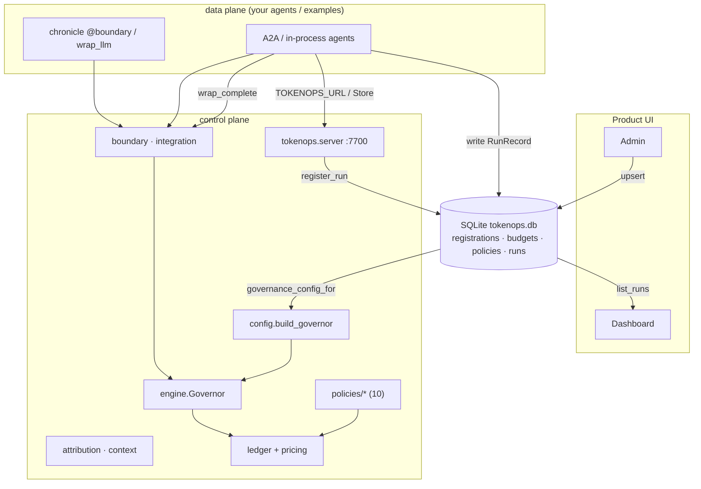

# TokenOps control plane — architecture & dependency graph

Where the code starts, how the modules depend on each other, and what each is for.
Control plane under `src/tokenops/control/`; SDK + plane; A2A demos and Chat/Simulator under
`examples/`; state shared via one SQLite file.

---

## Starting points (what you call)

| Entry point | Module | Purpose |
|-------------|--------|---------|
| `tokenops_run` / `instrument_app` | `control/run.py`, `instrument.py` | register-or-join + bind governance |
| `ControlPlaneClient` | `control/client.py` | SDK register_run (HTTP or embedded Store) |
| `python -m tokenops.server` | `server/app.py` | standalone control plane (:7700) |
| `POST /v1/tasks` | `examples/a2a/server.py` | task handler (run via `tokenops_run`) |
| `@boundary` + crossing hook | Chronicle + `control/crossing.py` | record crossing + govern ingest |
| `wrap_complete(…)` | `integration.py` | pre_call gate; dispatch via Chronicle `wrap_llm` |
| `GovernedChatModel` | `adapters/langchain.py` | LangChain `BaseChatModel` → governed complete_fn |
| `build_governor(config, price)` | `config.py` | `budgets:`/`policies:` → wired `Governor` |
| `Store.governance_config_for(agent)` | `store.py` | SQLite → exact `build_governor` dict |
| `seed_default_governance_if_empty()` | `store.py` | first-open seed from `default.yaml` `governance:` |
| `run_simulation(…)` | `examples/ui/simulator.py` | in-process research→summarize with trace log |

Native A2A servers under `examples/` wire these per request; Admin writes the store; Dashboard reads runs.

## Dependency + data-flow graph



## Runtime flow of one governed run

```
UI: POST /v1/tasks  (task only; no run_id)
  ├─ instrument_app binds RequestContext (service, intent, provider, model)
  ├─ with tokenops_run(client=…):  →  register-or-join + SpanContext + governance
  ├─ store/client.create_run(RunRecord status="running")
  │
  ├─ agent.run(…, complete_fn=wrap_complete(bound.…))
  │     pre_call  → worst-case / concurrency detectors
  │     dispatch  → chronicle.wrap_llm(providers.complete)
  │     observe   → LLM Observation via on_crossing → Governor
  │     @boundary tool  → Chronicle envelope + observe
  │
  ├─ delegate  →  child server (same run_id, X-TokenOps-Parent-Span-Id)
  │     child spend → shared ledger (no parent rollup)
  │
  └─ client.update_run(status, halt_reason, cost_micros, steps)
```

The **Ledger** splits state by lifetime:

| State | Scope | Backend |
|---|---|---|
| Spend, inflight, halt | Cross-process (same `run_id`) | SQLite `ledger_*` tables in `tokenops.db` |
| Step window, local step count | Per agent process | In-memory `RunState` |

SQLite also holds config + run history. Pass `store=` into `build_governor(...)` so A2A servers share accumulators.

## DB maintenance

```bash
make db-clear    # wipe all rows
make db-reseed   # replace governance from default.yaml
make db-reset    # clear + reseed
```

Scripts: `scripts/db_clear.py`, `scripts/db_reseed.py`. UI `get_store()` uses `auto_seed=False`
(governance seeded at deploy or via scripts; Admin owns edits).

## Design rules

- Dependencies point **one way**; the data plane never imports control internals except taps.
- **Store assembles the `build_governor` dict** — YAML `governance:` is reference + auto-seed source.
- **Per-request governor** — typical isolation for window / local halt; spend / inflight / halt may be shared via Store.
- **Fail closed** — missing registration, unknown template, unknown price → refuse.

See also `docs/run-attribution.md` and `docs/concurrency.md` (thread / multi-process contract).
