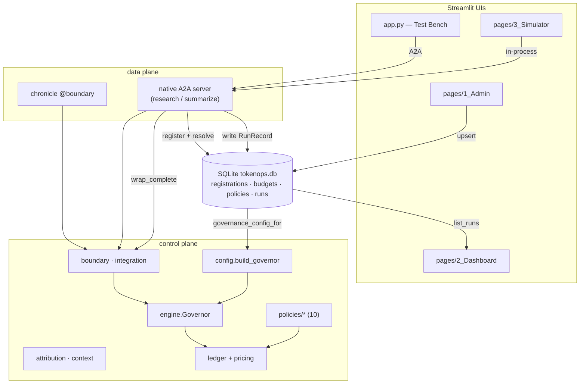

# TokenOps control plane — architecture & dependency graph

Where the code starts, how the modules depend on each other, and what each is for.
Control plane under `src/tokenops/control/`; wired into native A2A servers, Chronicle
boundaries, and three Streamlit UIs; state shared via one SQLite file.

---

## Starting points (what you call)

| Entry point | Module | Purpose |
|-------------|--------|---------|
| `POST /v1/runs` + `POST /v1/tasks` | `a2a/server.py` | register run dims; task requires `X-TokenOps-Run-Id` |
| `build_attribution(reg, service=…)` | `attribution.py` | registration → ledger `Attribution` |
| `@boundary` + `emit_observation` | `chronicle/boundary.py`, `control/boundary.py` | record crossing + govern ingest |
| `wrap_complete(…)` | `integration.py` | provider wrap — **pre_call** before dispatch |
| `build_governor(config, price)` | `config.py` | `budgets:`/`policies:` → wired `Governor` |
| `Store.governance_config_for(agent)` | `store.py` | SQLite → exact `build_governor` dict |
| `seed_default_governance_if_empty()` | `store.py` | first-open seed from `default.yaml` `governance:` |
| `run_simulation(…)` | `ui/simulator.py` | in-process research→summarize with trace log |

Native A2A servers wire these per request; Admin writes the store; Dashboard reads runs;
Simulator runs in-process with full control-plane visibility.

## Dependency + data-flow graph



## Runtime flow of one governed run

```
POST /v1/runs  { intent, user_dims }  →  run_registrations
POST /v1/tasks  +  X-TokenOps-Run-Id
  ├─ downstream_run_scope / entry_run_scope  →  SpanContext + registration in contextvars
  ├─ governor = build_governor(store.governance_config_for(agent), price, ApplyControls())
  ├─ store.create_run(RunRecord status="running")
  │
  ├─ agent.run(…, complete_fn=wrap_complete(…))
  │     pre_call  → worst-case / concurrency detectors
  │     dispatch  → providers.complete
  │     observe   → LLM Observation (via emit_observation in wrap)
  │     @boundary tool  → Chronicle envelope + observe
  │
  ├─ delegate  →  child server (same run_id, X-TokenOps-Parent-Span-Id)
  │     observe(delegate rollup) on parent
  │
  └─ store.update_run(status, halt_reason, cost_micros, steps)
```

The **Ledger** is per-process in-run state; **SQLite** is cross-process (config + run history).
Registration dims flow into `Attribution.tags` but seeded budgets use `dimension: run` only
(see issue #8 for user/tag scoping).

## DB maintenance

```bash
make db-clear    # wipe all rows
make db-reseed   # replace governance from default.yaml
make db-reset    # clear + reseed
```

Scripts: `scripts/db_clear.py`, `scripts/db_reseed.py`. UI `get_store()` uses `auto_seed=False`
(governance seeded at deploy or via scripts; Admin owns edits).

## Design rules

- Dependencies point **one way**; the data plane never imports control internals except taps.
- **Store assembles the `build_governor` dict** — YAML `governance:` is reference + auto-seed source.
- **Per-request governor** — concurrent runs never share window/halt/spend state.
- **Fail closed** — missing registration, unknown template, unknown price → refuse.

See also `docs/run-attribution.md`.
