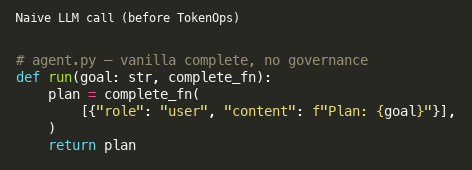
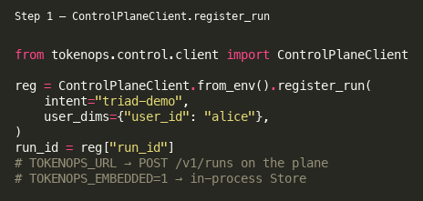
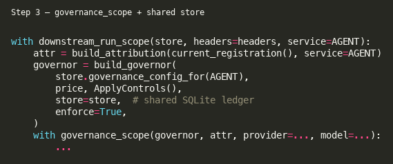
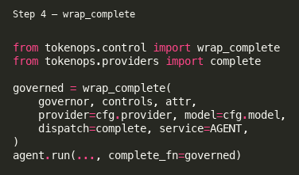
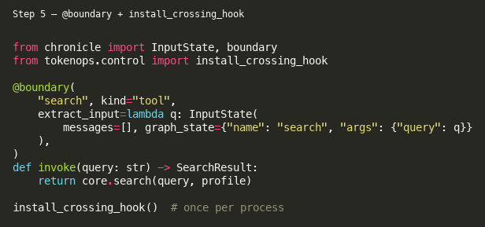

# Field guide: adding TokenOps to the triad bench

This walkthrough mirrors how TokenOps was wired into the **Planner → Researcher → Writer**
bench under `bench/triad/`. Code screenshots below were generated with
`python scripts/render_field_guide_snippets.py` → [`docs/field-guide/assets/`](field-guide/assets/).

Related: [`CONTROL_PLANE.md`](../CONTROL_PLANE.md), [`control-plane-deploy.md`](control-plane-deploy.md),
[`docs/run-attribution.md`](run-attribution.md).
Copilot skill (same procedure): [`.cursor/skills/integrate-tokenops/SKILL.md`](../.cursor/skills/integrate-tokenops/SKILL.md).

## Shape

| Agent | Port | Role | TokenOps seams |
|-------|------|------|----------------|
| **Planner** | 8011 | Break goal into questions + outline; entry agent | `register_run` (client) → `downstream_run_scope` → `wrap_complete` → delegate rollups |
| **Researcher** | 8012 | Tools (`search` / `fetch`) gather facts | `wrap_complete` + Chronicle `@boundary` on tools + `install_crossing_hook` |
| **Writer** | 8013 | Final answer from findings | `wrap_complete`; planner observes `delegate_writer` rollup |

Naive agent logic lives in each `agent.py`. Instrumentation lives in each `server.py`
(and `researcher/tools.py` for tool boundaries).

```
ControlPlaneClient.register_run
        │
        ▼
POST /v1/tasks  +  X-TokenOps-Run-Id  ──▶  Planner
                                              │ wrap_complete (plan LLM)
                                              │ delegate_researcher (same run_id)
                                              ▼
                                         Researcher
                                              │ wrap_complete + @boundary(search/fetch)
                                              │ return findings + cost_micros
                                              ▼
                                         Planner observes rollup
                                              │ delegate_writer
                                              ▼
                                           Writer
                                              │ wrap_complete
                                              ▼
                                         Planner observes rollup → TaskResponse
```

### Before: naive complete

Agent code stays injectable — no TokenOps imports in `agent.py`:



<details>
<summary>SVG fallback</summary>


</details>

## Step 1 — Register the run (control plane)

Before any agent work, the client registers once:



```python
from tokenops.control.client import ControlPlaneClient

reg = ControlPlaneClient.from_env().register_run(
    intent="triad-demo",
    user_dims={"user_id": "alice"},
)
run_id = reg["run_id"]
```

- With `TOKENOPS_URL=http://localhost:7700`, registration hits the standalone plane
  (`POST /v1/runs`).
- With `TOKENOPS_EMBEDDED=1` (tests), the client uses an in-process `Store` at `TOKENOPS_DB`.

See `bench/triad/client.py` (`submit_goal_sync_with_meta`).

## Step 2 — Propagate `run_id` on every A2A hop

Entry and delegates send the same header:

```python
from tokenops.control.context import RUN_ID_HEADER, PARENT_SPAN_ID_HEADER

headers = {RUN_ID_HEADER: run_id}
if parent_span_id:
    headers[PARENT_SPAN_ID_HEADER] = parent_span_id
```

Planner requires the header (raises `RunNotRegisteredError` if missing). Downstream agents
resolve registration via `downstream_run_scope(store, headers=..., service=...)`.

## Step 3 — Open governance scope + build governor

Each server handler (Planner / Researcher / Writer) follows the same pattern:



```python
with downstream_run_scope(store, headers=headers, service=AGENT):
    reg = current_registration()
    attr = build_attribution(reg, service=AGENT)
    controls = ApplyControls()  # or PreviewControls()
    governor = build_governor(
        store.governance_config_for(AGENT),
        price,
        controls,
        store=store,          # shared SQLite ledger across processes
        enforce=True,
    )
    governor.ledger.open_run(run_id)
    store.create_run(RunRecord(run_id=run_id, agent=AGENT, status="running", ...))

    with governance_scope(governor, attr, provider=..., model=...):
        ...
```

`store=store` is what makes **cost_budget** / **step_cap** shared across the three processes
for one `run_id`.

## Step 4 — Wrap the LLM (`wrap_complete`)

Replace the bare provider call with a governed dispatch:



```python
from tokenops.control import wrap_complete
from tokenops.providers import complete

governed = wrap_complete(
    governor, controls, attr,
    provider=cfg.provider,
    model=cfg.model,
    dispatch=complete,
    service=AGENT,
)
# Pass governed into the naive agent as complete_fn
agent.run(..., complete_fn=governed)
```

`wrap_complete` runs **pre_call** policies (e.g. `pre_call_worst_case`, `cost_guard`) and
emits LLM observations for **observe** policies (`cost_budget`, `step_cap`, …).

## Step 5 — Tool boundaries (`@boundary` + crossing hook)

On the Researcher, tools are Chronicle boundaries so TokenOps can observe tool crossings
without changing the agent loop:



```python
from chronicle import InputState, boundary

@boundary(
    "search",
    kind="tool",
    extract_input=lambda query: InputState(
        messages=[], graph_state={"name": "search", "args": {"query": query}}
    ),
)
def invoke(query: str) -> SearchResult:
    return core.search(query, profile)
```

Install the process-wide hook once per server:

```python
from tokenops.control import install_crossing_hook

install_crossing_hook()
```

That wires Chronicle `on_crossing` → `Governor.observe` (see `tokenops.control.crossing`).

`tool_reject` / `tool_output_cap` in the seed registry include `search` and `fetch`
(`src/tokenops/config/triad.yaml`).

## Step 6 — Delegate rollup (parent observes child spend)

After each A2A delegate returns `cost_micros`, the Planner records a rollup observation:

```python
from tokenops.control import observation_from_delegate

governor.observe(
    observation_from_delegate(
        attr,
        boundary_id="delegate_researcher",  # or delegate_writer
        rolled_up_cost_micros=child_cost,
        ts=time.time(),
        service="planner",
    )
)
```

Refuse to delegate when the shared run budget is already exhausted
(`ledger.budget_left("run_llm_cap", ...)`), matching the two-agent research bench.

## Step 7 — Errors and HTTP surface

```python
app = create_a2a_app(..., handler=with_governance_errors(handler))
if should_mount_run_registration():
    mount_run_registration(app, store)  # only when not using TOKENOPS_URL plane
install_crossing_hook()
```

`with_governance_errors` maps `Halt` / registration errors to HTTP responses the client can
inspect (`status`, `halt_reason`, `cost_micros`).

## Governance seed (demo)

`src/tokenops/config/triad.yaml` seeds:

- **cost_budget** on `run_llm_cap` ($0.50 / run) — easier to trip than the $2 two-agent default
- **step_cap** at 12 steps across the hoppy pipeline
- **tool_reject** registry `[search, fetch]`

Reset / reseed:

```bash
TOKENOPS_CONFIG=src/tokenops/config/triad.yaml make db-reset
```

## How to run

```bash
# Local processes
make run-triad
# or: make control-plane && make writer-server && make researcher-server && make planner-server

# Docker (plane + triad; keeps default research/summarize compose intact)
docker compose -f docker-compose.yml -f docker-compose.triad.yml up --build tokenops planner researcher writer

# Client
export TOKENOPS_URL=http://localhost:7700
python -c "
from bench.triad import submit_goal_sync_with_meta
r, meta = submit_goal_sync_with_meta('http://localhost:8011', 'Explain mid-market CRM pricing')
print(meta['status'], meta['cost_micros'], r.summary[:200])
"

# Tests (mocked LLM)
python -m pytest tests/test_triad_e2e.py -q
```

## Regenerating screenshots

```bash
python scripts/render_field_guide_snippets.py
# writes docs/field-guide/assets/{01..05}-*.{svg,png}
```

## Checklist for a new agent

1. Keep `agent.py` vanilla (injectable `complete_fn`).
2. In `server.py`: `downstream_run_scope` → `build_governor(..., store=store)` →
   `governance_scope` → `wrap_complete` → `with_governance_errors` → `install_crossing_hook`.
3. Mark tools with Chronicle `@boundary`; rely on the crossing hook for observe.
4. Propagate `X-TokenOps-Run-Id` (and parent span) on every outbound A2A call.
5. Parent: `observation_from_delegate` for child `cost_micros`.
6. Register runs via `ControlPlaneClient`, not ad-hoc IDs.
