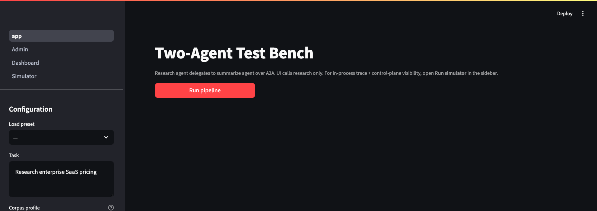
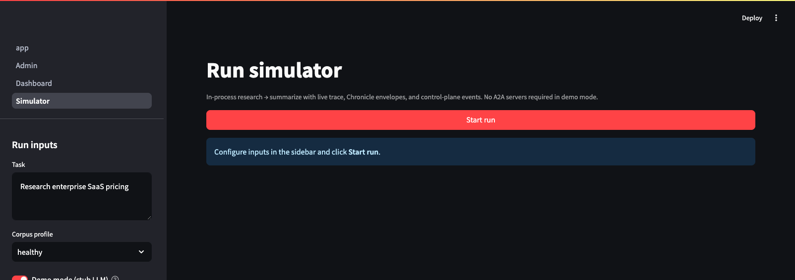
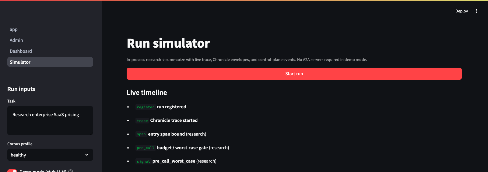
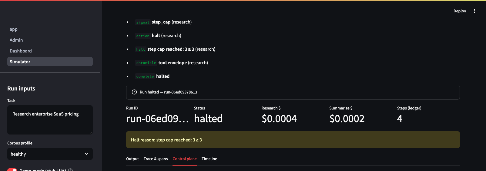
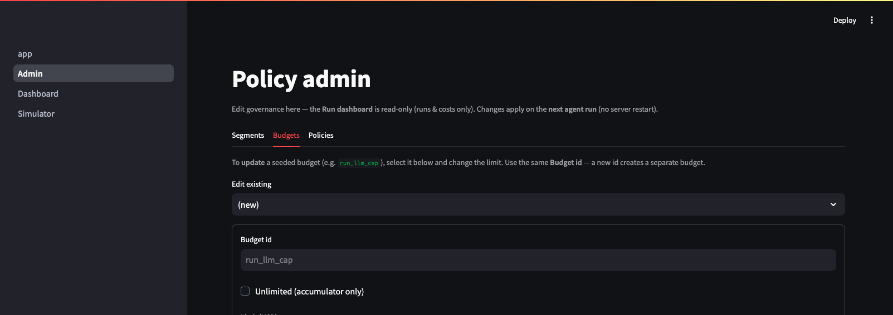
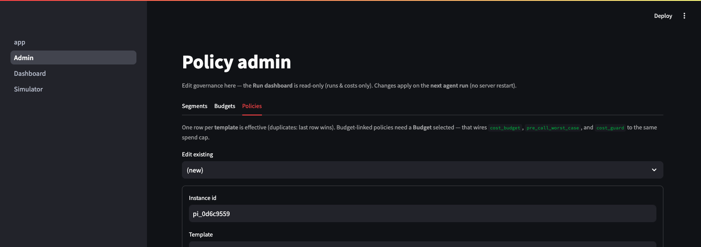
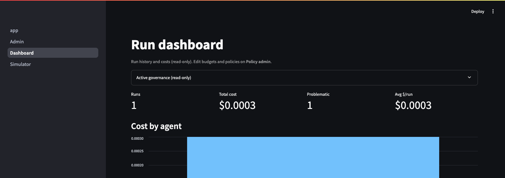

# Demo bench walkthrough

The reference **two-agent test bench** demonstrates TokenOps on a research → summarize pipeline.
Runnable code lives under [`examples/`](../../examples/).

```bash
make install
make demo          # plane + research + summarize + Admin UI
make bench-ui      # Chat + Simulator (screenshots below)
```

Screenshots below are from the local Streamlit UI shipped with the demo harness (`examples/ui`).

## Pages

| Page | Purpose |
|---|---|
| **Test Bench** | Live pipeline — research agent delegates to summarize over HTTP |
| **Run simulator** | In-process run with live timeline, trace, and control-plane tabs |
| **Policy admin** | Edit budgets, policies, and segments (plane Admin UI) |
| **Dashboard** | Run history, aggregate cost, problematic runs |

---

## 1. Test Bench — trigger a live run

Configure task, corpus profile, and agent endpoints in the sidebar. Click **Run pipeline** to send a task to the research agent, which delegates to summarize.



---

## 2. Run simulator — in-process demo (no API keys required)

**Demo mode** uses a stub LLM so you can explore governance without provider credentials. Click **Start run** to execute research → summarize in one process.



### Live timeline

The timeline shows LLM / tool steps, spend, and control actions (HALT, MUTATE, …) as they fire.



### Control-plane tab

Spend and policy trips for the run.



---

## 3. Policy admin — budgets and policies

Edit run budgets and policy params. Changes apply on the next run (no restart).





---

## 4. Dashboard — history and cost



---

## Shared ledger across agents

→ Full walkthrough with screenshots: [Shared ledger](./shared-ledger.md)

[Back to overview](../../README.md) · [Shared ledger](./shared-ledger.md) · [Policies](../policies/)
