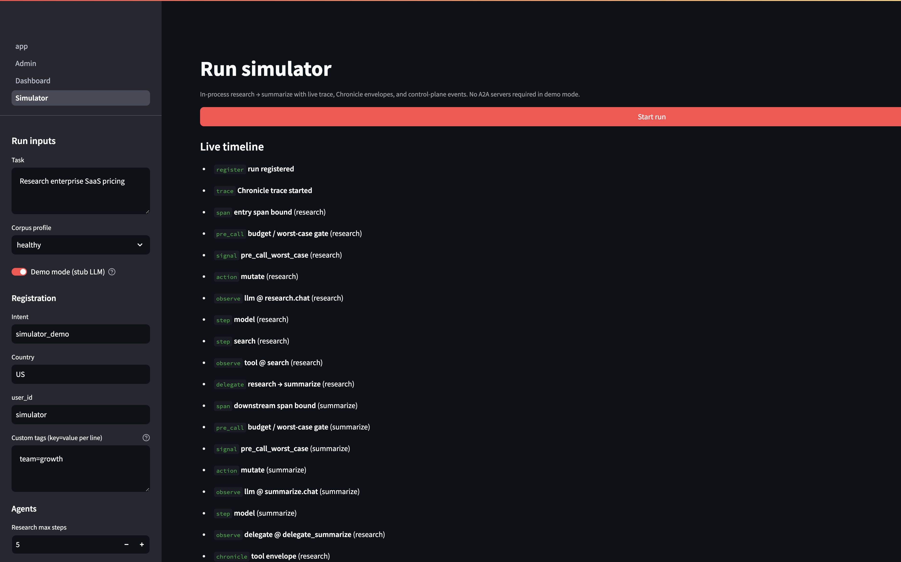
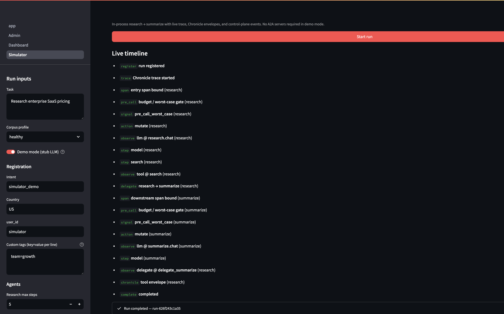
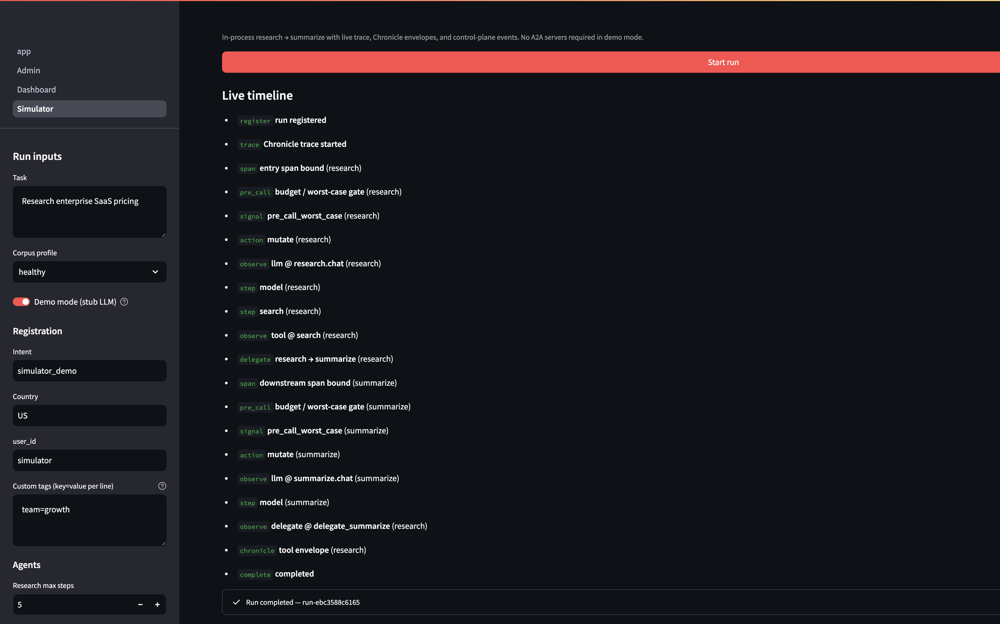

# Shared ledger: before vs after

Cross-process A2A runs (research → summarize) share one `run_id` but used to get **independent in-memory ledgers** per agent process. Each agent saw the full `run_llm_cap`; combined spend could exceed the run budget.

The shared SQLite ledger (`ledger_spent` in `tokenops.db`) makes spend and halt state visible to every `Governor` instance backed by the same `Store`.

## Demo setup

```bash
python scripts/prep_ledger_comparison.py   # sets run_llm_cap to $0.001
SEARCH_BACKEND=corpus make bench-ui        # Chat + Simulator (reproducible stub search)
```

Simulator defaults: **healthy** corpus, **demo mode** on, task *Research enterprise SaaS pricing*.  
Demo stub costs: research ~$0.0010 + summarize ~$0.0002 ≈ **$0.0012** total.

## Results at $0.001 run cap

| | Before (in-memory ledger) | After (shared SQLite ledger) |
|---|---|---|
| **Status** | `completed` | `halted` |
| **Research $** | $0.0010 | $0.0008 |
| **Summarize $** | $0.0002 | $0.0000 |
| **Total run $** | **$0.0012** (over cap) | **$0.0008** (within cap) |
| **Halt reason** | — | `pre_call_worst_case` — summarize blocked |


### Before — separate ledgers, run completes over cap

Research spends ~$0.0010 against its ledger. Summarize opens a **fresh** ledger with the full $0.001 cap and spends ~$0.0002. Status is `completed` even though combined spend exceeds the run budget.





### After — shared spend, summarize blocked

Research spend is written to `ledger_spent` in SQLite. When summarize starts, `budget_left` reflects remaining headroom (~$0.0002). `pre_call_worst_case` trips before the summarize LLM call; the run halts with no summarize spend.




## Reproduce

```bash
python scripts/prep_ledger_comparison.py
SEARCH_BACKEND=corpus make bench-ui
```

**Run simulator → Start run** (demo mode, healthy corpus). Use **Total run $** and **Run budget cap** in the summary bar.

Automated check:

```bash
pytest tests/test_cross_process_budget_gating.py -q
```

Public overview (screenshots + narrative): [TokenOps wiki — shared ledger](https://github.com/theagentplane/tokenops-wiki/blob/main/docs/shared-ledger.md).

## What changed

- `Store`: `ledger_spent`, `ledger_inflight`, `ledger_halt` tables
- `Ledger(store=…)`: spend/inflight/halt via SQLite when a store is provided
- Native A2A servers + simulator pass `store=` into `build_governor`
- Summarize server: pre-delegate `budget_left` check before accepting work
